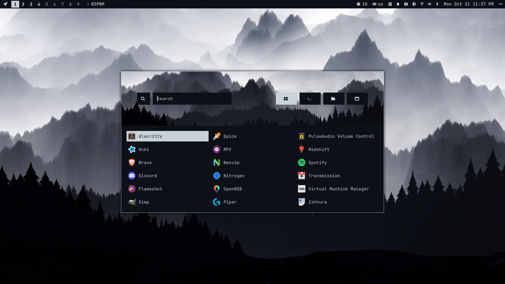
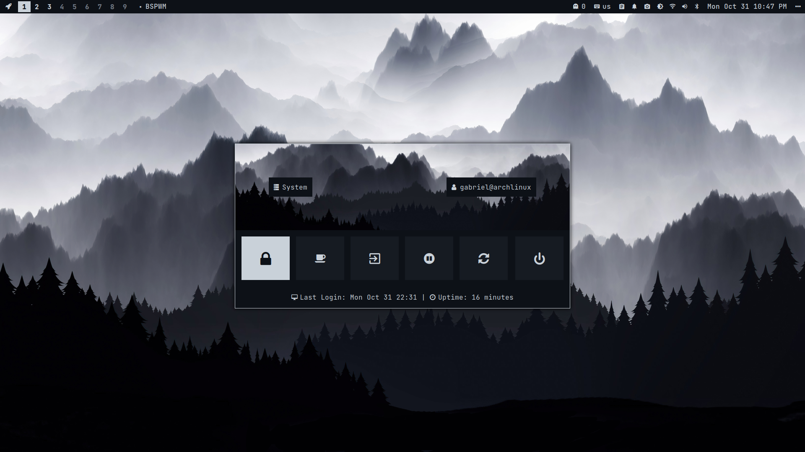
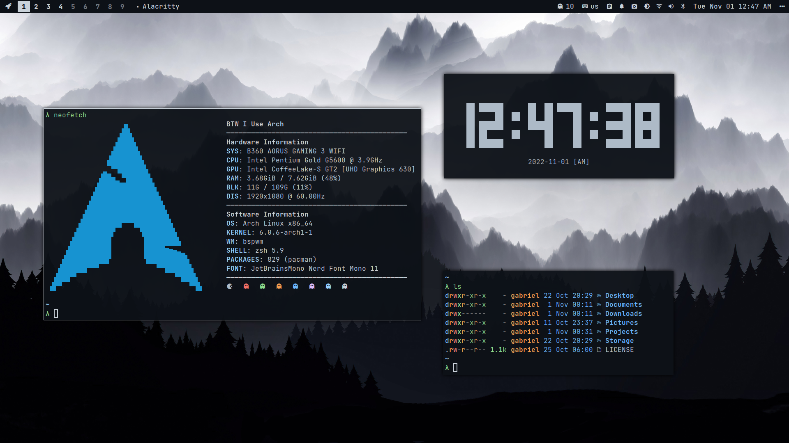
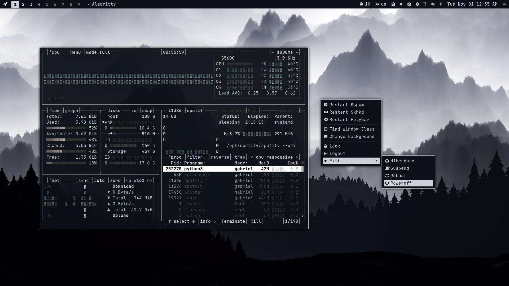
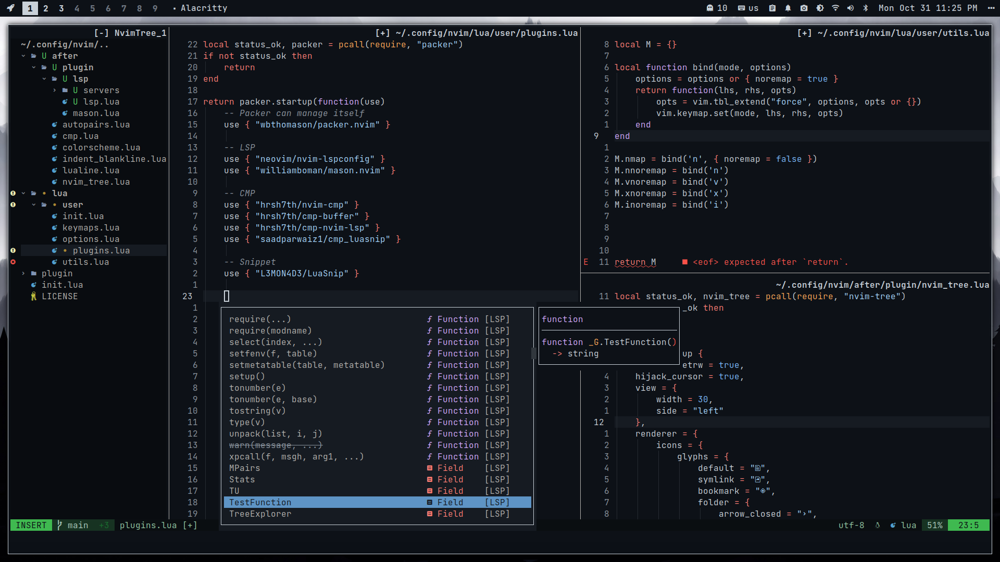
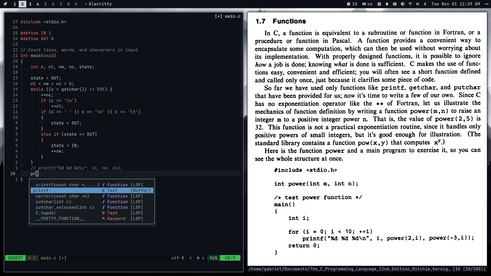
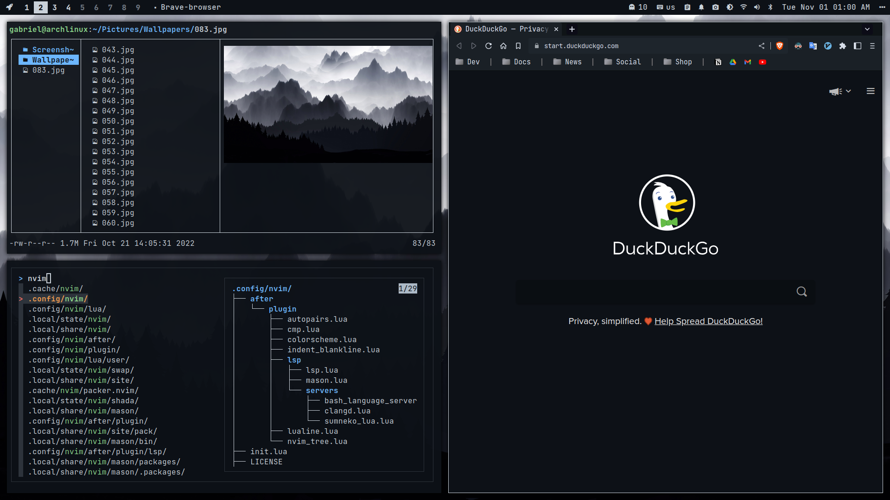
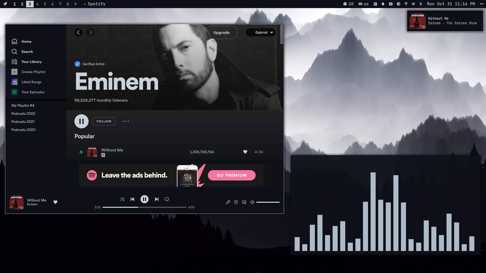

# Programs I use:

+ **OS**: [Arch Linux](https://archlinux.org/)
+ **WM**: [Bspwm](https://github.com/baskerville/bspwm)
+ **Compositor**: [Picom](https://github.com/yshui/picom)
+ **Launcher/Powermenu**: [Rofi](https://github.com/davatorium/rofi)
+ **Status Bar**: [Polybar](https://github.com/polybar/polybar)
+ **Menu**: [Jgmenu](https://github.com/jgmenu/jgmenu)
+ **Terminal**: [Alacritty](https://github.com/alacritty/alacritty)
+ **Shell**: [Zsh](https://www.zsh.org/)
+ **Editor**: [Neovim](https://github.com/neovim/neovim)
+ **Notification**: [Dunst](https://github.com/dunst-project/dunst)
+ **File Manager**: [Lf](https://github.com/gokcehan/lf)
+ **PDF Viewer**: [Zathura](https://github.com/pwmt/zathura)
+ **Fonts**: [JetBrains Mono Nerd Font](https://github.com/JetBrains/JetBrainsMono)
 
 
 
 
 
 
 
 
 
 
 

## Screeshots:

---

---

---

---

---

---

---

